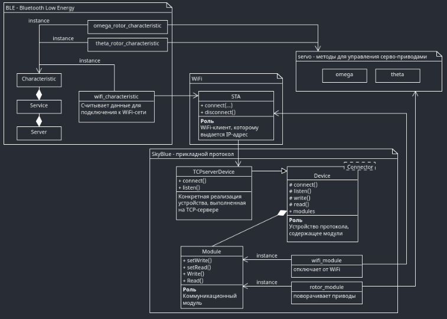

# Servo Controller

Прошивка для контроллера, управляющего серво-приводами при помощи ШИМ сигнала.

## Зависимости

Приложение использует [открытую BLE-библиотеку](https://github.com/Greggot/ESP-BLE-PlusPlus) собственного авторства, 
а также аналогичную библиотеку для работы с сетью - [ESP-Networkxx](https://github.com/Greggot/ESP-Networkxx).

## Структура приложения

Прошивка настраивает два ШИМ-канала для управления серво-приводами `MG-995`.
За взаимодействиями с приводами отвечает модуль `servo`.  

Сервер GATT, инициализируемый BLE-библиотекой, отвечает за:

1. Подключение к WiFi-сети. Сервис - `0xC111E1A`, характеристика - `0x4ED`. Для подключения 
необходимо записать в характеристику C-style строки: `SSID`-`Password`.  
2. Управления углом поворота определенного привода. Сервис - `0xCFFFAE`.  
    - Привод Omega. Характеристика - `0xA0111`
    - Привод Theta. Характеристика - `0xA111E`

При подключении контроллера к WiFi сети, запускается протокол уровня приложения, который
состоит из сервера с отдельными `модулями`. Каждый модуль имеет обратный вызов для чтения и записи.
Каждый модуль имеет свой тип и номер - идентификатор, по которому к нему можно обратиться.

Сервер протокола для данного приложения содержит:

1. **Модуль работы с WiFi** - на данный момент при записи в него контроллер перезагружается, 
тем самым отключаясь от WiFi-сети. Для штатного отключения в конфигурации нужно включить 
множественное подключение для BLE-сервера.
2. **Модуль работы с серво-приводами** - при записи в него вектора оси привода выполняется поворот 
привода на определенный угол. В данном случае, считается, что у каждого привода MG-995 есть всего
одна ось свободы. `Ось-Z` локальной системы координат каждого привода совпадает с этой самой осью.

UML-диаграмма представлена в `docs/app.uxf`. Вот ее сжатое содержание:
